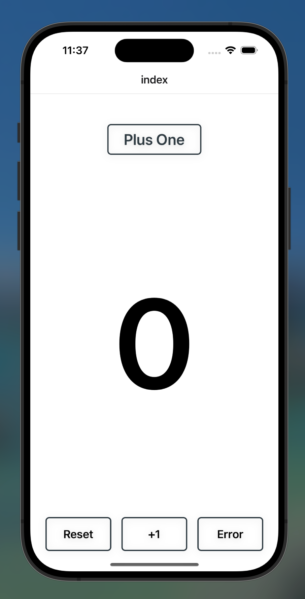

# PlusOne

A simple React Native counter application built with Expo that demonstrates basic state management and error handling.



## Features

- **Large Number Display**: Shows a prominently displayed counter value
- **Reset Button**: Resets the counter back to zero
- **+1 Button**: Increments the counter by one
- **Error Button**: Intentionally throws an error for testing error boundaries and debugging

## Screenshot

The app displays a clean, minimal interface with a large number in the center and three action buttons at the bottom.

## Prerequisites

Before running this app, make sure you have the following installed:

- **Node.js** (v16 or higher)
- **npm** or **yarn**
- **Xcode** (for iOS development on macOS)
- **Android Studio** (for Android development)
- **Expo CLI**: `npm install -g @expo/cli`
- **CocoaPods**: `sudo gem install cocoapods` (for iOS)

## Installation

1. Clone the repository:
```bash
git clone <repository-url>
cd PlusOne
```

2. Install dependencies:
```bash
npm install
```

3. Install iOS pods (macOS only):
```bash
npx pod-install
```

## Running the App

### iOS (macOS only)

1. Prebuild the native code:
```bash
npx expo prebuild
```

2. Run on iOS:
```bash
npm run ios
```

### Android

1. Prebuild the native code:
```bash
npx expo prebuild
```

2. Run on Android:
```bash
npm run android
```

### Development Server

To start the Expo development server:
```bash
npx expo start
```

## Usage

- **Tap the "+1" button** to increment the counter
- **Tap the "Reset" button** to reset the counter to zero
- **Tap the "Error" button** to trigger an intentional error (useful for testing error handling)


## Error Testing

The "Error" button is included specifically for testing error boundaries and debugging workflows. When pressed, it will throw a JavaScript error that can be caught by error reporting services or error boundaries in your app.

## Troubleshooting

### Common Issues

1. **Metro bundler cache issues**: Run `npx expo start --clear`
2. **iOS build issues**: Delete `ios/` folder and run `npx expo prebuild` again
3. **Android build issues**: Delete `android/` folder and run `npx expo prebuild` again
4. **Pod installation issues**: Run `cd ios && pod deintegrate && pod install`

### Expo Orbit

If you're using Expo Orbit for device simulation, make sure you have:
- Installed Expo Orbit from the Mac App Store or Expo website
- Configured your simulators and devices in Orbit
- Started your development server with `npx expo start`

## Built With

- **React Native** - Mobile app framework
- **Expo** - Development platform
- **JavaScript/TypeScript** - Programming language

## License

This project is licensed under the MIT License - see the LICENSE file for details.
